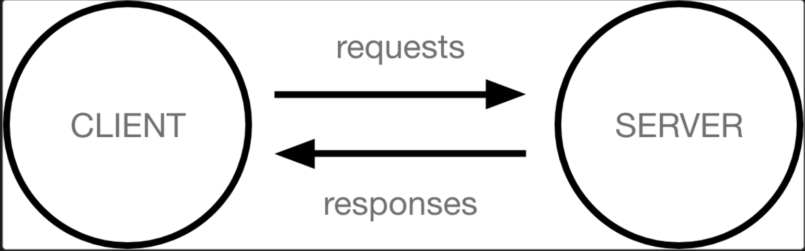
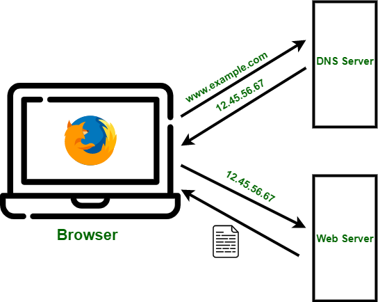

<div align=center>

<h1>Introduction to Web Development</h1>

</div>

# Table of Contents

- [1. Introduction](#1-introduction)
  - [How Website Works](#how-website-works)
- [2. Web Development Tools](#2-web-development-tools)
  - [Web Development Tools](#web-development-tools)
  - [Hosting Providers](#hosting-providers)
- [3. HTML (HyperText Markup Language)](#3-html-hypertext-markup-language)
  - [What is HTML?](#what-is-html)
  - [Anatomy of an HTML element](#anatomy-of-an-html-element)
  - [Nesting elements](#nesting-elements)
  - [Void elements](#void-elements)
  - [Basic Structure of an HTML Document](#basic-structure-of-an-html-document)
- [4. CSS (Cascading Style Sheets)](#4-css-cascading-style-sheets)
  - [What is CSS?](#what-is-css)
  - [Basic CSS Syntax](#basic-css-syntax)
  - [Ways to Add CSS to HTML](#ways-to-add-css-to-html)
  - [CSS Selectors](#css-selectors)
- [5. Javascript](#5-javascript)
  - [What is Javascript?](#what-is-javascript)
  - [Javascript Environment](#javascript-environment)
    - [Client-Side JavaScript Environment](#client-side-javascript-environment)
    - [Server-Side JavaScript Environment](#server-side-javascript-environment)
    - [Client-Side vs. Server-Side JavaScript](#client-side-vs-server-side-javascript)
  - [Programming in Javascript](#programming-in-javascript)
    - [Basics](#basics)
    - [Comments](#comments)
    - [Declarations](#declarations)
    - [Variable scope](#variable-scope)
    - [Data structures and types](#data-structures-and-types)
      - [Data types](#data-types)
      - [Array](#array)
    - [Control flow and error handling](#control-flow-and-error-handling)
      - [Conditional statements](#conditional-statements)
      - [Exception handling statements](#exception-handling-statements)
    - [Loops and iteration](#loops-and-iteration)
    - [Break and Continue](#break-and-continue)
    - [Functions](#functions)
      - [Defining Functions](#defining-functions)
      - [Function Parameters and Arguments](#function-parameters-and-arguments)
      - [Return Values](#return-values)
      - [Anonymous Functions](#anonymous-functions)
      - [Immediately Invoked Function Expression (IIFE)](#immediately-invoked-function-expression-iife)
      - [Arrow Functions](#arrow-functions)
      - [Higher-Order Functions](#higher-order-functions)
      - [Function Scope and `this`](#function-scope-and-this)
      - [Best Practices](#best-practices)
    - [Asynchronous Programming](#asynchronous-programming)
      - [Key Concepts in Asynchronous JavaScript](#key-concepts-in-asynchronous-javascript)
      - [Ways to Handle Asynchronous Code](#ways-to-handle-asynchronous-code)
      - [Common Asynchronous Use Cases](#common-asynchronous-use-cases)
      - [Best Practices for Asynchronous Code](#best-practices-for-asynchronous-code)
- [6. Example Project](/Introduction%20To%20Web%20Development/Simple%20Ecommerce/)

# 1. Introduction

## How Website Works ?

Computers connected to the internet are called clients and servers. A simplified diagram of how they interact might look like this:



Clients are the typical web user's internet-connected devices (for example, your computer connected to your Wi-Fi, or your phone connected to your mobile network) and web-accessing software available on those devices (usually a web browser like Firefox or Chrome).

Servers are computers that store webpages, sites, or apps. When a client device wants to access a webpage, a copy of the webpage is downloaded from the server onto the client machine to be displayed in the user's web browser.



1. Every client and server have an ip address on internet
2. When client go to www.example.com, client will create dns query to determine what server ip
3. Client send request to server with ip from dns query
4. Server send response to client, the web browser will render html,css,js file from server

# 2. Web Development Tools

## Web Development Tools:

- **Text Editors / IDE**: [Visual Studio Code](https://code.visualstudio.com/), [Cursor](https://www.cursor.com/), [WebStorm](https://www.jetbrains.com/webstorm/).
- **Browsers**: Chrome, Firefox, Edge.
- **Version Control System**: Git.

## Hosting Providers:

- GitHub Pages, Netlify, Vercel, AWS, etc.

# 3. HTML (HyperText Markup Language)

## What is HTML?

HTML (HyperText Markup Language) is a markup language that tells web browsers how to structure the web pages you visit. It can be as complicated or as simple as the web developer wants it to be. HTML consists of a series of elements, which you use to enclose, wrap, or mark up different parts of content to make it appear or act in a certain way. The enclosing tags can make content into a hyperlink to connect to another page, italicize words, and so on.

## Anatomy of an HTML element


- **The opening tag**: This consists of the name of the element (in this example, p for paragraph), wrapped in opening and closing angle brackets. This opening tag marks where the element begins or starts to take effect. In this example, it precedes the start of the paragraph text.

- **The content**: This is the content of the element. In this example, it is the paragraph text.

- **The closing tag**: This is the same as the opening tag, except that it includes a forward slash before the element name. This marks where the element ends. Failing to include a closing tag is a common beginner error that can produce peculiar results.

## Nesting elements

```html
<p>My cat is <strong>very</strong> grumpy.</p>
```

In the example above, we opened the p element first, then opened the strong element. For proper nesting, we should close the strong element first, before closing the p.

## Void elements

Not all elements follow the pattern of an opening tag, content, and a closing tag. Some elements consist of a single tag, which is typically used to insert/embed something in the document. Such elements are called void elements. For example, the  element embeds an image file onto a page:

```html

```

## Basic Structure of an HTML Document

```
<!DOCTYPE html>
<html lang="en">
<head>
    <meta charset="UTF-8">
    <meta name="viewport" content="width=device-width, initial-scale=1.0">
    <title>Document</title>
</head>
<body>

</body>
</html>
```

**Key Components of the Syntax**

1. `<!DOCTYPE html>` : Declares the document type as HTML5.
2. `<html>` : The root element of the document. The lang="en" attribute specifies the language.
3. `<head>` : Contains metadata (information about the document) like the character set, title, and viewport settings.
4. `<meta>`
   - `charset="UTF-8"` : Ensures the document supports all characters (like emojis, special characters).
   - `name="viewport"` : Makes the page responsive for mobile devices.
5. `<title>` : Defines the title shown in the browser tab.
6. `<body>` : Contains all visible content, like text, images, and links.

---

More about HTML :

- https://developer.mozilla.org/en-US/docs/Learn_web_development/Core/Structuring_content
- https://developer.mozilla.org/en-US/docs/Web/HTML

# 4. CSS (Cascading Style Sheets)

Cascading Style Sheets (CSS) is a stylesheet language used to describe the presentation of a document written in HTML or XML (including XML dialects such as SVG, MathML or XHTML). CSS describes how elements should be rendered on screen, on paper, in speech, or on other media.

## What is CSS?

Like HTML, CSS is not a programming language. It's not a markup language either. CSS is a style sheet language. CSS is what you use to selectively style HTML elements.

## Basic CSS Syntax

CSS follows a simple syntax of selectors and declarations.

**Syntax Structure:**

```css
selector {
  property: value;
}
```

- Selector: Targets the HTML element(s) to style.
- Property: Defines the style aspect to modify (e.g., color, font-size).
- Value: Specifies the value for the property.

**Example:**

```css
h1 {
  color: blue;
  font-size: 2em;
  text-align: center;
}
```

## Ways to Add CSS to HTML

1. **Inline CSS**

   CSS directly inside an HTML element using the `style` attribute.

   ```html
   <p style="color: red; font-weight: bold;">This is inline CSS.</p>
   ```

2. **Internal CSS**

   CSS written inside a `<style>` tag within the <head> section of the HTML document.

   ```html
   <!DOCTYPE html>
   <html lang="en">
     <head>
       <meta charset="UTF-8" />
       <meta name="viewport" content="width=device-width, initial-scale=1.0" />
       <title>Internal CSS</title>
       <style>
         body {
           background-color: lightgray;
         }
         p {
           color: green;
           font-size: 16px;
         }
       </style>
     </head>
     <body>
       <p>This is styled using internal CSS.</p>
     </body>
   </html>
   ```

3. **External CSS**

   CSS written in a separate file and linked to the HTML document.

   `index.html`

   ```html
   <!DOCTYPE html>
   <html lang="en">
     <head>
       <meta charset="UTF-8" />
       <meta name="viewport" content="width=device-width, initial-scale=1.0" />
       <title>External CSS</title>
       <link rel="stylesheet" href="styles.css" />
     </head>
     <body>
       <p>This is styled using external CSS.</p>
     </body>
   </html>
   ```

   `styles.css`

   ```css
   body {
     background-color: #f0f0f0;
   }
   p {
     color: navy;
     font-family: Arial, sans-serif;
   }
   ```

## CSS Selectors

- **Element Selector**: Targets elements by tag name.

  Example:

  ```css
  p {
    color: red;
  }
  ```

- **Class Selector**: Targets elements by class name

  Example:
  `index.html`

  ```html
  <div class="container">Hello</div>
  ```

  `styles.css`

  ```css
  .container {
    padding: 20px;
    background-color: yellow;
  }
  ```

- **ID Selector**: Targets an element by its unique ID.

  Example:
  `index.html`

  ```html
  <div id="main-content">Content</div>
  ```

  `styles.css`

  ```css
  #main-content {
    font-size: 18px;
    color: black;
  }
  ```

- **Group Selector**: Targets multiple elements

  Example:

  ```css
  h1,
  p {
    margin: 10px;
  }
  ```

---

More about CSS:

- https://developer.mozilla.org/en-US/docs/Learn_web_development/Getting_started/Your_first_website/Styling_the_content
- https://css-tricks.com/
- https://www.w3schools.com/cssref/index.php

# 5. Javascript

## What is Javascript?

JavaScript is a cross-platform, object-oriented scripting language used to make webpages interactive (e.g., having complex animations, clickable buttons, popup menus, etc.). There are also more advanced server side versions of JavaScript such as Node.js, which allow you to add more functionality to a website than downloading files (such as realtime collaboration between multiple computers). Inside a host environment (for example, a web browser), JavaScript can be connected to the objects of its environment to provide programmatic control over them.

## Javascript Environment

JavaScript is a versatile language that can run in both client-side (browser) and server-side (Node.js, deno, bun or similar runtimes) environments. Each environment provides different tools and APIs to handle their specific tasks.

### Client-Side JavaScript Environment

The client-side environment refers to JavaScript running in the browser, where it is primarily used to create interactive and dynamic web pages.

**Features**

1. **Global Object: window (or globalThis)**

   Provides access to browser-related APIs and functionalities.
   Example:

   ```js
   window.alert("Hello World!");
   ```

2. **DOM Manipulation:**

   JavaScript can access and modify the HTML and CSS of a web page using the DOM (Document Object Model). Example:

   ```js
   document.getElementById("example").textContent = "Hello Client!";
   ```

3. **Browser-Specific APIs:**
   - fetch API: For making HTTP requests.
   - localStorage / sessionStorage: For client-side data storage.
   - Navigator API: To get information about the user's browser and device.
   - Canvas API: For drawing graphics.
4. **Event Handling:**
   JavaScript can listen for and handle events such as clicks, form submissions, or key presses. Example:

   ```js
   document.querySelector("button").addEventListener("click", () => {
     alert("Button clicked!");
   });
   ```

### Server-Side JavaScript Environment

The server-side environment refers to JavaScript running outside the browser, typically on a server using Node.js, deno, bun or other JavaScript runtimes.

**Features**

1. **Global Object: global (or globalThis)**

   Does not include browser-specific objects like window or document.

2. **Server-Specific APIs:**

   - File System (fs): For reading and writing files.
   - HTTP (http): For creating web servers and handling requests/responses.
   - Process (process): For accessing environment variables and runtime info.
   - Example:

   ```js
   const fs = require("fs");
   fs.writeFileSync("example.txt", "Hello Server!");
   ```

3. **Package Management:**
   Uses npm or yarn to manage dependencies and install external libraries.
4. **Asynchronous Operations:**
   Non-blocking I/O allows handling multiple requests efficiently. Example:

   ```js
   const http = require("http");
   http
     .createServer((req, res) => {
       res.write("Hello, Server!");
       res.end();
     })
     .listen(8080);
   ```

5. **No DOM or Browser-Specific APIs:**
   Server-side JavaScript does not have access to the DOM or browser-related objects like document, window, or localStorage.

6. **Use Cases:**
   - Backend logic (e.g., handling requests, interacting with databases).
   - Server rendering for frontends (e.g., Next.js).

### Client-Side vs. Server-Side JavaScript

| **Aspect**                | **Client-Side**                          | **Server-Side**                         |
| ------------------------- | ---------------------------------------- | --------------------------------------- |
| **Global Object**         | `window`, `globalThis`                   | `global`, `globalThis`                  |
| **Primary Use**           | UI interactivity, DOM manipulation       | Backend logic, database interaction     |
| **APIs**                  | DOM, Canvas, `fetch`, Web Storage        | `fs`, `http`, `process`, `os`           |
| **Execution Context**     | Browser                                  | Node.js, Deno, or other runtimes        |
| **Event Handling**        | User events (clicks, keypresses, etc.)   | Request/response events                 |
| **Access to File System** | No                                       | Yes                                     |
| **Package Management**    | No direct package management             | Uses `npm` or `yarn`                    |
| **Examples**              | Form validation, dynamic content updates | APIs, file handling, real-time services |

## Programming in Javascript

### Basics

JavaScript borrows most of its syntax from Java, C, and C++, but it has also been influenced by Awk, Perl, and Python.

example:

```c
// c code
int sum = 0;
for(int i=0; i < 10; i++){
    sum += i;
}
```

```js
// js code
let sum = 0;
for (let i = 0; i < 10; i++) {
  sum += i;
}
```

### Comments

The syntax of comments is the same as in C++ and in many other languages:

```js
// a one line comment

/* this is a longer,
 * multi-line comment
 */
```

### Declarations

JavaScript has three kinds of variable declarations.

- **var** : Declares a variable, optionally initializing it to a value.

- **let** : Declares a block-scoped, local variable, optionally initializing it to a value.

- **const** : Declares a block-scoped, read-only named constant.

### Variable scope

A variable may belong to one of the following scopes:

- **Global scope**: The default scope for all code running in script mode.
- **Module scope**: The scope for code running in module mode.
- **Function scope**: The scope created with a function.

In addition, variables declared with let or const can belong to an additional scope:

- **Block scope**: The scope created with a pair of curly braces (a block).

When you declare a variable outside of any function, it is called a global variable, because it is available to any other code in the current document. When you declare a variable within a function, it is called a local variable, because it is available only within that function.

let and const declarations can also be scoped to the block statement that they are declared in.

```js
if (Math.random() > 0.5) {
  const y = 5;
}
console.log(y); // ReferenceError: y is not defined
```

However, variables created with var are not block-scoped, but only local to the function (or global scope) that the block resides within.

```js
if (true) {
  var x = 5;
}
console.log(x); // x is 5
```

### Data structures and types

#### Data types

The latest ECMAScript standard defines eight data types:

- Seven data types that are primitives:

  1. Boolean. true and false.
  2. null. A special keyword denoting a null value. (Because JavaScript is case-sensitive, null is not the same as Null, NULL, or any other variant.)
  3. undefined. A top-level property whose value is not defined.
  4. Number. An integer or floating point number. For example: 42 or 3.14159.
  5. BigInt. An integer with arbitrary precision. For example: 9007199254740992n.
  6. String. A sequence of characters that represent a text value. For example: "Howdy".
  7. Symbol. A data type whose instances are unique and immutable.

- and Object

#### Array

In JavaScript, arrays are considered a type of object. However, they are a specialized kind of object specifically designed for ordered data storage. This means arrays have special features and methods, but they are still fundamentally objects.

In JavaScript, arrays aren't primitives but are instead Array objects with the following core characteristics:

- JavaScript arrays are resizable and can contain a mix of different data types. (When those characteristics are undesirable, use typed arrays instead.)
- JavaScript arrays are not associative arrays and so, array elements cannot be accessed using arbitrary strings as indexes, but must be accessed using nonnegative integers (or their respective string form) as indexes.
- JavaScript arrays are zero-indexed: the first element of an array is at index 0, the second is at index 1, and so on — and the last element is at the value of the array's length property minus 1.
- JavaScript array-copy operations create shallow copies. (All standard built-in copy operations with any JavaScript objects create shallow copies, rather than deep copies).

**Create an array**

```js
// 'fruits' array created using array literal notation.
const fruits = ["Apple", "Banana"];
console.log(fruits.length);
// 2

// 'fruits2' array created using the Array() constructor.
const fruits2 = new Array("Apple", "Banana");
console.log(fruits2.length);
// 2

// 'fruits3' array created using String.prototype.split().
const fruits3 = "Apple, Banana".split(", ");
console.log(fruits3.length);
// 2
```

### Control flow and error handling

JavaScript supports a compact set of statements, specifically control flow statements, that you can use to incorporate a great deal of interactivity in your application. This chapter provides an overview of these statements.

#### Conditional statements

1. **if...else statement**

   Use the if statement to execute a statement if a logical condition is true. Use the optional else clause to execute a statement if the condition is false.

   ```js
   function checkData() {
     if (document.form1.threeChar.value.length === 3) {
       return true;
     } else {
       alert(
         `Enter exactly three characters. ${document.form1.threeChar.value} is not valid.`
       );
       return false;
     }
   }
   ```

2. **switch statement**

   A switch statement allows a program to evaluate an expression and attempt to match the expression's value to a case label. If a match is found, the program executes the associated statement.

   ```js
   switch (fruitType) {
     case "Oranges":
       console.log("Oranges are $0.59 a pound.");
       break;
     case "Apples":
       console.log("Apples are $0.32 a pound.");
       break;
     case "Bananas":
       console.log("Bananas are $0.48 a pound.");
       break;
     case "Cherries":
       console.log("Cherries are $3.00 a pound.");
       break;
     case "Mangoes":
       console.log("Mangoes are $0.56 a pound.");
       break;
     case "Papayas":
       console.log("Papayas are $2.79 a pound.");
       break;
     default:
       console.log(`Sorry, we are out of ${fruitType}.`);
   }
   console.log("Is there anything else you'd like?");
   ```

#### Exception handling statements

You can throw exceptions using the throw statement and handle them using the try...catch statements.

**throw statement**
Use the throw statement to throw an exception. A throw statement specifies the value to be thrown:

```js
throw expression;
```

You may throw any expression, not just expressions of a specific type. The following code throws several exceptions of varying types:

```js
throw "Error2"; // String type
throw 42; // Number type
throw true; // Boolean type
throw {
  toString() {
    return "I'm an object!";
  },
};
```

#### `try...catch` statement

The try...catch statement in JavaScript is used to handle exceptions (errors) that occur during the execution of code. It allows developers to run code that may throw errors without crashing the entire program and provides a way to respond to those errors gracefully.

```js
try {
  // Code that may throw an error
} catch (error) {
  // Code to handle the error
} finally {
  // Optional block that always runs, regardless of error
}
```

Example:

```js
try {
  let result = 10 / 0; // No error here, but logical issue
  console.log(result); // Output: Infinity
  JSON.parse("{ invalid JSON }"); // This will throw an error
} catch (error) {
  console.log("An error occurred:", error.message);
}
```

```js
// Asynchronous example
async function example() {
  try {
    let result = await fetch("https://api.example.com");
  } catch (error) {
    console.log("Caught async error:", error.message);
  }
}
```

### Loops and iteration

JavaScript provides several looping constructs to iterate over data or execute code multiple times. Here's an overview of the most commonly used loops:

1. **`for` Loop**

   A basic loop that iterates a specific number of times.

   ```js
   for (let i = 0; i < 5; i++) {
     console.log("Iteration:", i);
   }
   ```

2. **`while` Loop**

   Repeats as long as the specified condition is true.

   ```js
   let count = 0;
   while (count < 5) {
     console.log("Count:", count);
     count++;
   }
   ```

3. **`do...while` Loop**

   Executes the code block once before checking the condition.

   ```js
   let count = 0;
   do {
     console.log("Count:", count);
     count++;
   } while (count < 5);
   ```

4. **`for...of` Loop**

   Used to iterate over iterable objects like arrays, strings, and more.

   ```js
   let fruits = ["apple", "banana", "cherry"];
   for (let fruit of fruits) {
     console.log(fruit);
   }
   ```

5. **`for...in` Loop**

   Used to iterate over iterable objects like arrays, strings, and more.

   ```js
   let person = { name: "Alice", age: 25, city: "New York" };
   for (let key in person) {
     console.log(key + ":", person[key]);
   }
   ```

6. Using `Array.forEach`

   ```js
   let numbers = [1, 2, 3, 4, 5];
   numbers.forEach((number, index) => {
     console.log(`Index: ${index}, Value: ${number}`);
   });
   ```

### Break and Continue

1. `break`: Exits the loop entirely.

   ```js
   for (let i = 0; i < 10; i++) {
     if (i === 5) {
       break;
     }
     console.log(i);
   }
   // Output: 0, 1, 2, 3, 4
   ```

2. `continue`: Skips the current iteration.

   ```js
   for (let i = 0; i < 10; i++) {
     if (i % 2 === 0) {
       continue; // Skip even numbers
     }
     console.log(i);
   }
   // Output: 1, 3, 5, 7, 9
   ```

### Functions

#### Defining Functions

In JavaScript, a **function** is a block of reusable code designed to perform a particular task. Functions allow you to write modular, maintainable, and reusable code.

---

#### **Defining Functions**

1. **Function Declaration**

   ```javascript
   function greet() {
     console.log("Hello, world!");
   }
   ```

   - Can be called before or after its definition due to **hoisting**.
   - Example:
     ```javascript
     greet(); // Output: Hello, world!
     ```

2. **Function Expression**

   ```javascript
   const greet = function () {
     console.log("Hello, world!");
   };
   ```

   - Stored in a variable and does not have a name unless defined explicitly.
   - Not hoisted; must be defined before being called.

3. **Arrow Function**
   Introduced in ES6, it provides a shorter syntax for writing functions.
   ```javascript
   const greet = () => {
     console.log("Hello, world!");
   };
   ```
   - Does not have its own `this` or `arguments` context.

---

#### **Function Parameters and Arguments**

1. **With Parameters**

   ```javascript
   function greet(name) {
     console.log("Hello, " + name + "!");
   }
   greet("Alice"); // Output: Hello, Alice!
   ```

2. **Default Parameters**

   ```javascript
   function greet(name = "Guest") {
     console.log("Hello, " + name + "!");
   }
   greet(); // Output: Hello, Guest!
   ```

3. **Rest Parameters**
   Used to pass a variable number of arguments to a function.
   ```javascript
   function sum(...numbers) {
     return numbers.reduce((a, b) => a + b, 0);
   }
   console.log(sum(1, 2, 3, 4)); // Output: 10
   ```

---

#### **Return Values**

A function can return a value using the `return` statement.

```javascript
function add(a, b) {
  return a + b;
}
let result = add(5, 3);
console.log(result); // Output: 8
```

---

#### **Anonymous Functions**

Functions without a name, often used as arguments in other functions.

```javascript
setTimeout(function () {
  console.log("This runs after 2 seconds.");
}, 2000);
```

---

#### **Immediately Invoked Function Expression (IIFE)**

A function executed immediately after it's defined.

```javascript
(function () {
  console.log("IIFE is executed!");
})();
```

---

#### **Arrow Functions**

1. **Single Expression (Implicit Return)**

   ```javascript
   const square = (x) => x * x;
   console.log(square(4)); // Output: 16
   ```

2. **Multiple Parameters**

   ```javascript
   const multiply = (a, b) => a * b;
   console.log(multiply(3, 4)); // Output: 12
   ```

3. **No Parameters**
   ```javascript
   const greet = () => console.log("Hello!");
   greet(); // Output: Hello!
   ```

---

#### **Higher-Order Functions**

Functions that take other functions as arguments or return functions.

```javascript
function applyOperation(a, b, operation) {
  return operation(a, b);
}

let result = applyOperation(3, 4, (x, y) => x + y);
console.log(result); // Output: 7
```

---

#### **Function Scope and `this`**

1. **`this` in Regular Functions**
   The value of `this` depends on how the function is called.

   ```javascript
   const obj = {
     name: "Alice",
     greet: function () {
       console.log("Hello, " + this.name);
     },
   };
   obj.greet(); // Output: Hello, Alice
   ```

2. **`this` in Arrow Functions**
   Arrow functions do not bind their own `this`; they inherit it from the surrounding context.
   ```javascript
   const obj = {
     name: "Alice",
     greet: () => {
       console.log("Hello, " + this.name);
     },
   };
   obj.greet(); // Output: Hello, undefined
   ```

---

#### **Best Practices**

1. Use **arrow functions** for concise syntax when `this` is not needed.
2. Use **default parameters** to make functions more robust.
3. Use **IIFE** for code isolation in global scope.
4. Keep functions **small and focused** on a single task.
5. Always **name your functions** for better debugging unless explicitly using anonymous functions.

### Asynchronous Programming

In JavaScript, **asynchronous programming** allows you to perform tasks that take time (like fetching data from a server) without blocking the execution of other code. It ensures the application remains responsive, especially in environments like browsers, where users interact with the UI.

---

#### **Key Concepts in Asynchronous JavaScript**

1. **Synchronous vs Asynchronous**

   - **Synchronous**: Tasks are executed one after another, blocking the execution of subsequent tasks until the current one finishes.

     ```javascript
     console.log("Task 1");
     console.log("Task 2");
     console.log("Task 3");
     // Output: Task 1, Task 2, Task 3 (in order)
     ```

   - **Asynchronous**: Tasks can start, pause, and resume independently without blocking subsequent code.
     ```javascript
     console.log("Task 1");
     setTimeout(() => console.log("Task 2 (async)"), 1000);
     console.log("Task 3");
     // Output: Task 1, Task 3, Task 2 (async) (Task 2 runs after 1 second)
     ```

2. **Event Loop**
   JavaScript uses an **event loop** to manage asynchronous operations. It processes tasks in the call stack, handles asynchronous callbacks in the task queue, and ensures the main thread stays responsive.

---

#### **Ways to Handle Asynchronous Code**

1. **Callbacks**

   A function passed as an argument to another function and executed after an asynchronous task completes.

   **Example**:

   ```javascript
   function fetchData(callback) {
     setTimeout(() => {
       console.log("Data fetched");
       callback();
     }, 1000);
   }

   fetchData(() => {
     console.log("Callback executed");
   });
   ```

   **Drawback**: Can lead to "callback hell" when there are nested callbacks.

---

2. **Promises**

   Promises represent a value that will be available now, later, or never.

   **Example**:

   ```javascript
   const fetchData = new Promise((resolve, reject) => {
     setTimeout(() => {
       resolve("Data fetched");
     }, 1000);
   });

   fetchData
     .then((result) => console.log(result)) // Output: Data fetched
     .catch((error) => console.error(error));
   ```

   - **States of a Promise**:
   - **Pending**: Initial state.
   - **Fulfilled**: The operation completed successfully (`resolve` is called).
   - **Rejected**: The operation failed (`reject` is called).

---

3. **Async/Await**

   Introduced in ES8, `async/await` provides a simpler way to handle asynchronous code.

   **Example**:

   ```javascript
   const fetchData = () => {
     return new Promise((resolve) => {
       setTimeout(() => {
         resolve("Data fetched");
       }, 1000);
     });
   };

   const getData = async () => {
     console.log("Fetching data...");
     const data = await fetchData(); // Pauses here until the promise resolves
     console.log(data);
   };

   getData();
   // Output:
   // Fetching data...
   // Data fetched
   ```

   - **`async`**: Marks a function as asynchronous, which returns a promise.
   - **`await`**: Pauses the execution of the `async` function until the promise resolves or rejects.

---

#### **Common Asynchronous Use Cases**

1. **Fetching Data**

   ```javascript
   fetch("https://jsonplaceholder.typicode.com/posts/1")
     .then((response) => response.json())
     .then((data) => console.log(data))
     .catch((error) => console.error(error));
   ```

2. **Using Async/Await for Fetch**

   ```javascript
   const getPost = async () => {
     try {
       const response = await fetch(
         "https://jsonplaceholder.typicode.com/posts/1"
       );
       const data = await response.json();
       console.log(data);
     } catch (error) {
       console.error("Error fetching data:", error);
     }
   };

   getPost();
   ```

---

#### **Best Practices for Asynchronous Code**

1. **Avoid Callback Hell**: Use Promises or Async/Await instead of deeply nested callbacks.
2. **Handle Errors Gracefully**: Use `.catch` with Promises or `try...catch` with `async/await`.
3. **Keep Async Code Modular**: Break tasks into smaller functions for better readability.
4. **Use Concurrent Operations**: Run multiple asynchronous tasks simultaneously when possible (e.g., `Promise.all`).
